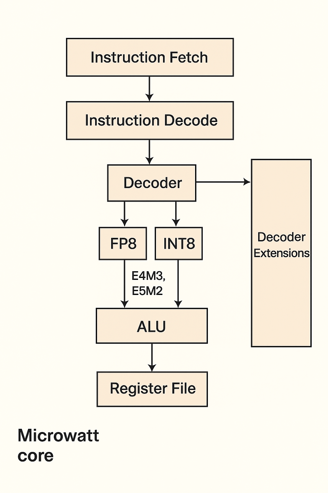

# Extending Power ISA in Microwatt with Lightweight INT8 and FP8 Scalar Operations

## Introduction
Modern AI/ML workloads increasingly rely on low-precision arithmetic to achieve high performance with reduced power and area.  
Two widely used formats are **FP8** (e.g., E4M3, E5M2) and **INT8**.  
- **FP8** helps in training or mixed-precision inference.  
- **INT8** is suited for quantized inference on edge devices.  

**Microwatt** is an open-source implementation of a POWER ISA 3.0 core.  
This project proposes extending the Microwatt core with native scalar operations for FP8 and INT8. These extensions will be integrated into Microwatt’s decode/execution pipeline, enabling **low-power, low-area edge AI use cases** without requiring wide vector units or GPUs.  

---

## Problem Statement
Design and implement **scalar-only extensions** to Power ISA in the Microwatt core, supporting **INT8 and FP8 arithmetic operations (ADD, SUB, MUL, MAC, Dot-Product for INT8)**.  
The design will include RTL testbenches, target **SKY130 process**, use an **open license**, and be reproducible under the **OpenFrame user project area**.  

---

## Objectives
- Implement scalar **FP8 operations**: ADD, SUB, MUL, MAC.  
- Implement scalar **INT8 operations**: ADD, SUB, MUL, MAC, Dot-Product.  
- Integrate these into Microwatt’s **decode and execute pipeline RTL**.  
- Provide full verification via **testbenches and simulation** (Verilog/VHDL + test vectors).  
- Implement synthesis targeting **SKY130 cells**.  
- Release the project under an **open-source license**.  

---

## Tools & Technologies

### Simulation / RTL
- Verilator (RTL simulation)  
- VHDL/Verilog testbenches  
- GHDL (optional)  
- GTKWave (waveform viewer)  

### Synthesis / FPGA / Physical Implementation
- Yosys + OpenLane (synthesis & layout)  
- SKY130 standard cell libraries  
- NextPNR (for FPGA prototyping if required)  
- OpenFrame user project infrastructure  

### Software / Dev Tools
- GCC for POWER ISA (toolchain)  
- Git / GitHub (for version control, public repo)  
- Documentation tools: Markdown / ReadTheDocs / GitHub Pages  

---

## Expected Outcomes
- A modified Microwatt core with **native FP8 & INT8 scalar extensions**.  
- Verified functionality through **RTL testbenches and simulation results**.  
- Synthesized netlist targeting **SKY130 technology**.  
- Open-source release with **documentation, source code, and reproducible flow**.  

---

## Block Diagram
  
*(Replace with your actual diagram image in the repo)*  

---

## License
This project will be released under an **open-source license (e.g., Apache-2.0 or MIT)** to encourage community adoption and contributions.  

